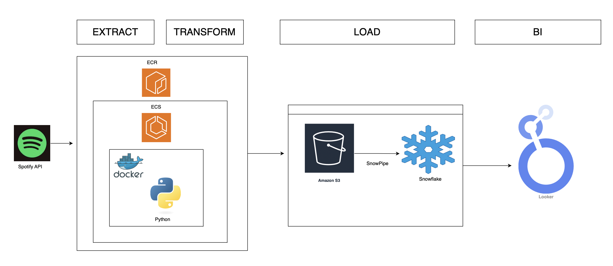

# 🎵 Spotify Analytics ETL Pipeline

A production-ready analytics engineering pipeline that extracts, transforms, and loads Spotify playlist data for downstream analytics and machine learning workflows. Built with modern data engineering best practices including singleton patterns, comprehensive error handling, and cloud-native architecture support.

## 🏗️ Architecture Overview

This ETL pipeline implements a containerized, cloud-native architecture leveraging AWS services and Snowflake for enterprise-grade data processing:



### Architecture Components

#### Extract & Transform Layer
- **Spotify API**: Source system for playlist metadata extraction
- **Containerized Processing**: 
  - **Docker**: Containerized Python ETL application for portability
  - **Amazon ECS/ECR**: Container orchestration and registry for production deployment
  - **Python Runtime**: Core ETL logic with pandas, boto3, and spotipy libraries

#### Load Layer
- **Amazon S3**: Data lake storage with SnowPipe integration
- **SnowPipe**: Automated, continuous data ingestion from S3 to Snowflake
- **Snowflake**: Cloud data warehouse for analytical workloads

#### Business Intelligence Layer
- **Looker**: Self-service analytics and visualization platform
- **Dashboard Capabilities**: Real-time music analytics, trending analysis, playlist insights

### Key Design Patterns
- **Singleton Pattern**: Connection management prevents resource exhaustion
- **Container-First Design**: Docker containerization ensures consistency across environments
- **Event-Driven Loading**: SnowPipe auto-ingestion on S3 file arrival
- **Microservices Architecture**: Decoupled components for independent scaling
- **Error Resilience**: Comprehensive exception handling with Loguru logging

## 🚀 Features

- **Containerized Deployment**: Docker-based architecture for consistent execution across environments
- **Cloud-Native Design**: 
  - Amazon ECS for container orchestration
  - Amazon ECR for container registry
  - Amazon S3 for scalable data lake storage
  - Snowflake for enterprise data warehousing
- **Automated Data Ingestion**: SnowPipe integration for real-time S3-to-Snowflake loading
- **Multi-source Extraction**: Pulls album, artist, and track metadata from Spotify playlists
- **Data Quality Assurance**: Deduplication, type conversion, and validation
- **Production-Ready Logging**: Structured logging with Loguru for observability
- **Business Intelligence Ready**: Direct integration with Looker for self-service analytics
- **Privacy-First Design**: Compatible with on-premises deployment (supports Ollama integration)

## 📦 Installation

### Prerequisites
- Python 3.8+
- Docker & Docker Compose
- Spotify Developer Account ([Get API Credentials](https://developer.spotify.com/))
- AWS Account (for S3, ECS, ECR services)
- Snowflake Account (for data warehouse)
- Looker Access (optional, for BI dashboards)

### Setup

1. **Clone the repository**
```bash
git clone https://github.com/yourusername/spotify-analytics-pipeline.git
cd spotify-analytics-pipeline
```

2. **Install dependencies**
```bash
pip install -r requirements.txt
```

3. **Configure credentials**
Create a `.config.ini` file in the project root:
```ini
[spotify-auth]
CLIENT_ID = your_spotify_client_id
CLIENT_SECRET_KEY = your_spotify_client_secret

[aws-auth]
aws_access_key_id = your_aws_access_key
aws_secret_access_key = your_aws_secret_key
region_name = us-east-1

[playlist-id]
PLAYLIST_ID = spotify_playlist_id_to_analyze

[s3-config]
bucket_name = your-s3-bucket-name
```

## 🔧 Usage

### Local Development
```bash
# Run directly with Python
python src/main/main.py

# Run with Docker
docker-compose up
```

### Container Deployment
```bash
# Build and run Docker container
docker build -t spotify-etl .
docker run --env-file .env spotify-etl

# Deploy to ECS
ecs-cli compose up --cluster spotify-cluster
```

### Programmatic Usage
```python
from src.main.connectors.spotify_connector import SpotifyConnection
from src.main.extractors.spotify_extractor import DataExtract
from src.main.transfomers.spotify_transformer import TransformData
from src.main.loaders.s3_loader import LoadDataS3

# Initialize connections
spotify = SpotifyConnection.get_instance(config)
s3 = S3Connection.get_instance(config)

# Extract playlist data
playlist_data = spotify.get_playlist_track(playlist_id)
extractor = DataExtract(playlist_data)
albums = extractor.extract_album_data(playlist_id)
artists = extractor.extract_artist_data(playlist_id)
songs = extractor.extract_song_data(playlist_data)

# Transform to DataFrames
transformer = TransformData(albums, artists, songs)
album_df = transformer.transform_album_data()
artist_df = transformer.transform_artist_data()
song_df = transformer.transform_song_data()

# Load to S3 (triggers SnowPipe)
s3_loader = LoadDataS3(album_df, artist_df, song_df, s3, bucket_name)
uploaded_files = s3_loader.load_all_to_s3()

# Data automatically flows to Snowflake via SnowPipe
# and becomes available in Looker dashboards
```

## 📊 Data Schema

### Albums Table
| Column | Type | Description |
|--------|------|-------------|
| id | string | Unique Spotify album ID |
| name | string | Album title |
| release_date | datetime | Album release date |
| total_tracks | integer | Number of tracks on album |
| url | string | Spotify web URL |

### Artists Table
| Column | Type | Description |
|--------|------|-------------|
| id | string | Unique Spotify artist ID |
| name | string | Artist name |
| url | string | Spotify artist profile URL |

### Songs Table
| Column | Type | Description |
|--------|------|-------------|
| id | string | Unique Spotify track ID |
| name | string | Track title |
| added_at | datetime | Timestamp when added to playlist |
| duration_ms | integer | Track duration in milliseconds |
| popularity | integer | Spotify popularity score (0-100) |
| url | string | Spotify track URL |
| album_id | string | Associated album ID |
| artist_ids | string | Primary artist ID |

## 🏭 Production Deployment

### Docker Containerization
Build and run the ETL pipeline in Docker:

```bash
# Build Docker image
docker build -t spotify-etl:latest .

# Run container locally
docker run -v $(pwd)/config:/app/config spotify-etl:latest

# Push to Amazon ECR
aws ecr get-login-password --region us-east-1 | docker login --username AWS --password-stdin [your-ecr-uri]
docker tag spotify-etl:latest [your-ecr-uri]/spotify-etl:latest
docker push [your-ecr-uri]/spotify-etl:latest
```

### Amazon ECS Deployment
Deploy to ECS for production workloads:

```json
{
  "family": "spotify-etl-task",
  "containerDefinitions": [
    {
      "name": "spotify-etl",
      "image": "[your-ecr-uri]/spotify-etl:latest",
      "memory": 2048,
      "cpu": 1024,
      "environment": [
        {"name": "S3_BUCKET", "value": "your-bucket-name"},
        {"name": "SNOWFLAKE_ACCOUNT", "value": "your-account"}
      ]
    }
  ]
}
```

### Snowflake & SnowPipe Integration
The pipeline uses SnowPipe for automated ingestion from S3:

```sql
-- Create pipe for continuous loading
CREATE OR REPLACE PIPE spotify_pipe
  AUTO_INGEST = TRUE
  AS
  COPY INTO spotify.raw.songs
  FROM @spotify_s3_stage
  FILE_FORMAT = (TYPE = CSV);

-- Monitor pipe status
SELECT SYSTEM$PIPE_STATUS('spotify_pipe');
```

### S3 Data Lake Structure
Organized with partitioning for efficient querying:
```
s3://your-bucket/
├── spotify-data/
│   ├── raw/
│   │   ├── year=2024/month=01/day=15/
│   │   │   ├── albums_20240115_103045.csv
│   │   │   ├── artists_20240115_103045.csv
│   │   │   └── songs_20240115_103045.csv
│   └── processed/
│       └── [transformed data]
```

### Looker Dashboard Integration
Connect Looker to Snowflake for real-time analytics:
- **Music Trends**: Track popularity over time
- **Artist Analytics**: Top performing artists by playlist
- **Playlist Insights**: Engagement metrics and patterns
- **Genre Analysis**: Musical characteristics distribution

## 🧪 Testing

Run unit tests:
```bash
pytest tests/
```

Validate data quality:
```bash
python scripts/validate_data.py
```

## 🔍 Monitoring & Observability

### Pipeline Monitoring
- **CloudWatch**: ECS task monitoring and alerting
- **Snowflake Query History**: Track data loading performance
- **S3 Event Notifications**: Trigger alerts on file uploads
- **Looker Alerts**: Business metric threshold monitoring

### Logging Strategy
The pipeline uses Loguru for structured logging:
- **INFO**: Successful operations and data metrics
- **ERROR**: Exceptions with full context
- **DEBUG**: Detailed execution flow

Example log output:
```
2024-01-15 10:30:45 | INFO | Connected to AWS S3 successfully.
2024-01-15 10:30:46 | INFO | Data Extraction for album Successful with 50 albums
2024-01-15 10:30:47 | INFO | Album Data transformed to DataFrame with shape (45, 5)
2024-01-15 10:30:48 | INFO | Album data uploaded to s3://bucket/spotify-data/raw/
2024-01-15 10:30:49 | INFO | SnowPipe notification sent for automatic ingestion
```

## 🛠️ Advanced Features

### GenAI Integration Opportunities
This pipeline is designed to support GenAI use cases:

- **Music Recommendation Models**: Feed cleaned data to recommendation engines
- **Sentiment Analysis**: Analyze track popularity patterns
- **Automated Playlist Generation**: Use transformed data for ML-driven playlist creation
- **Local LLM Integration**: Compatible with Ollama for on-premises AI analysis

### Data Quality Checks
- Automatic deduplication based on unique IDs
- Null value handling for missing tracks
- Date format standardization
- Data type validation

## 📁 Project Structure

```
.
├── data/                      # Local data storage (development)
│   ├── album/                 # Album CSV exports
│   ├── artist/                # Artist CSV exports
│   └── songs/                 # Song CSV exports
├── sql/                       # Database scripts
│   └── snowflake/            # Snowflake DDL and SnowPipe setup
├── src/main/                 # Core application code
│   ├── connectors/           # API and database connections
│   ├── extractors/           # Data extraction logic
│   ├── loaders/              # S3 and local loading strategies
│   └── transfomers/          # Data transformation logic
├── docker/                   # Docker configuration
│   ├── Dockerfile           # Container definition
│   └── docker-compose.yml   # Local orchestration
├── ecs/                      # ECS deployment configs
│   └── task-definition.json # ECS task configuration
├── requirements.txt          # Python dependencies
└── README.md                # Documentation
```

## 🎯 Future Enhancements

- **Real-time Streaming**: Integrate Kafka/Kinesis for real-time playlist updates
- **ML Pipeline**: Add feature engineering for recommendation models
- **dbt Integration**: Implement dbt for SQL-based transformations in Snowflake
- **GenAI Analytics**: Integrate LLMs for natural language querying of music data
- **Apache Airflow**: Orchestrate complex DAGs with dependencies
- **Data Quality Framework**: Implement Great Expectations for automated testing

## 🤝 Contributing

Contributions are welcome! Please feel free to submit a Pull Request. For major changes:

1. Fork the repository
2. Create your feature branch (`git checkout -b feature/AmazingFeature`)
3. Commit your changes (`git commit -m 'Add some AmazingFeature'`)
4. Push to the branch (`git push origin feature/AmazingFeature`)
5. Open a Pull Request

## 📝 License

This project is licensed under the MIT License - see the [LICENSE](LICENSE) file for details.

## 🙏 Acknowledgments

- Spotify Web API for providing comprehensive music metadata
- Spotipy library for Python API wrapper
- Boto3 for AWS integration
- Loguru for elegant logging

## 📧 Contact

For questions or collaboration opportunities, please reach out through GitHub issues or connect on LinkedIn.

---
*Built with ❤️ by an Analytics Engineer passionate about data pipelines and GenAI integration*